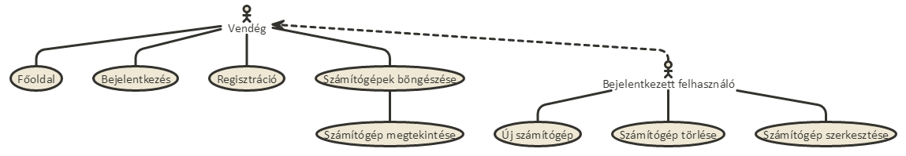
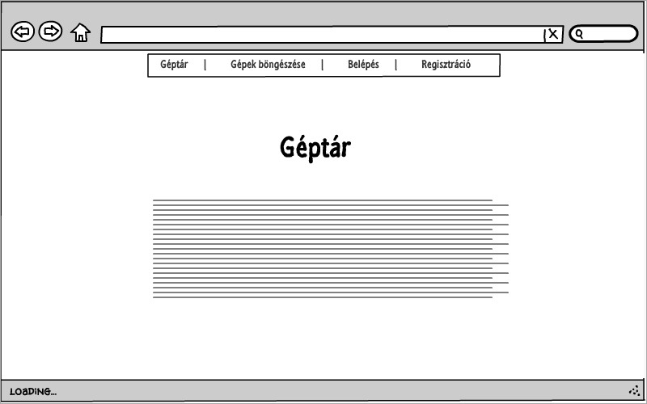
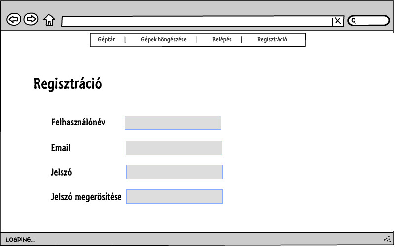
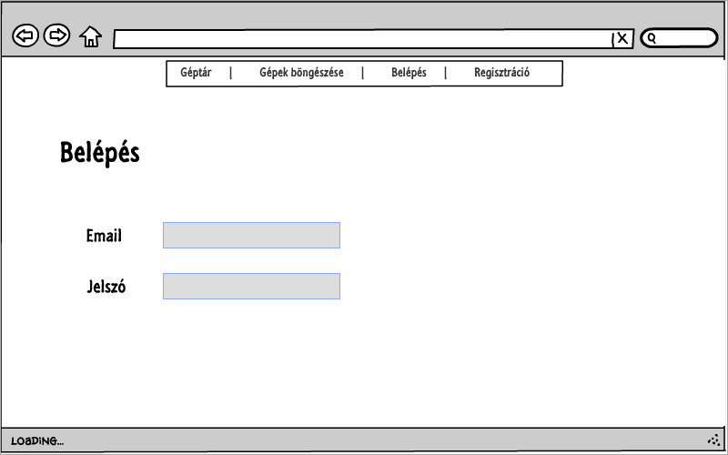
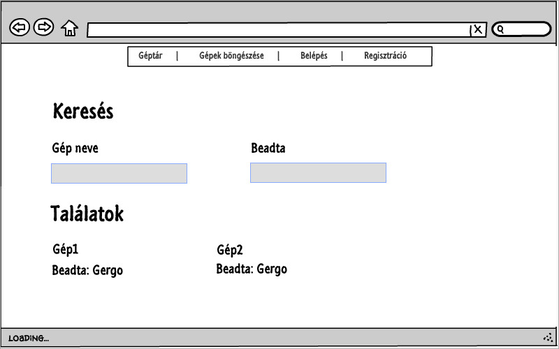
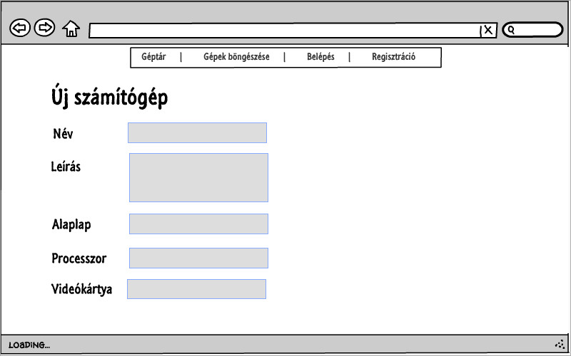
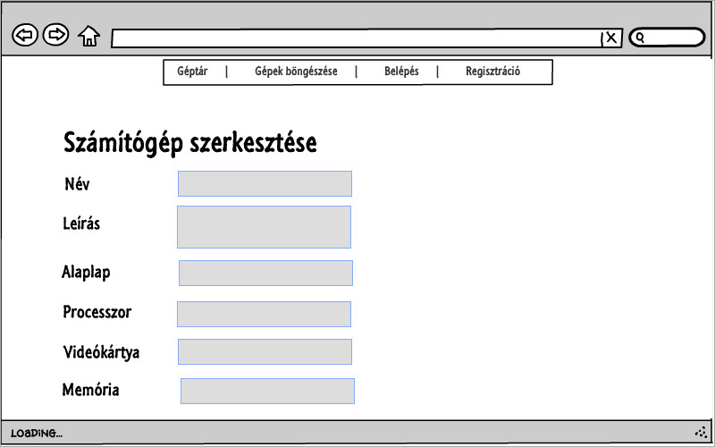

# Dokumentáció

Készítette: Jobban Gergő, TSGWZ6

**Alap ötlet:**

A program célja, hogy a felhasználók a szerintük legjobb / kedvenc számítógépüket összerakhatják, és megoszthatják másokkal, ezzel segíthetnek másoknak, akik új gépet szeretnének venni.
A vendégek megnézhetik a már kész gépeket, de regisztrációra, majd bejelentkezésre lesz szükségük a további funkciók használatához.
Bejelentkezett felhasználók felvehetnek gépeket, vagy a már meglévő, saját gépeiket módosíthatják vagy törölhetik.

**Funkcionális követelmények:**

Vendégeknek:
* Regisztráció
* Bejelentkezés
* Meglévő gépek megtekintése
  
Bejelentkezett felhasználóknak:
* Új gép felvétele
* Meglévő gépek adatainak módosítása
* Meglévő gépek törlése

**Nem funkcionális követelmények:**

* Áttekinthetőség - Átlátható elrendezés, jó kinézet.
* Biztonságos működés - Jelszavak használata bizonyos funkciók védelmére.
* Karbantarthatóság, bővíthetőség
* Gyors működés

**Használatieset-modell**

**Végpontok**
* GET/: főoldal
* GET/login: bejelentkező oldal
* POST/login: bejelentkezési adatok elküldése
* GET/register: regisztrációs oldal
* POST/register: regisztrációs adatok elküldése
* GET/logout: kijelentkező oldal
* GET/computers: számítógép lista oldal
* GET/computers/create: új számítógép felvétele
* POST/computers/create: új számítógép felvételéhez szükséges adatok elküldése
* GET/computers/id: számítógép adatok
* GET/computers/id/delete: számítógép törlése
* GET/computers/id/edit: számítógép módosítása
* POST/computers/id/edit: számítógép módosítása, adatok elküldése

**Oldalvázlatok**

Főoldal:

Regisztráció:

Belépés:

Böngészés:

Új gép:

Megtekintés:

Szerkesztés:

**Designtervek**

Főoldal:

Regisztráció:

Belépés:

Böngészés:

Új gép:

Megtekintés:

Szerkesztés:

